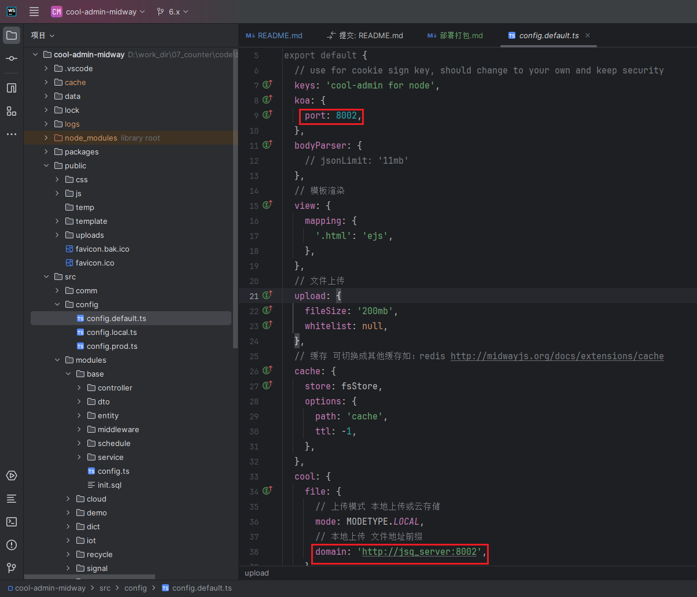
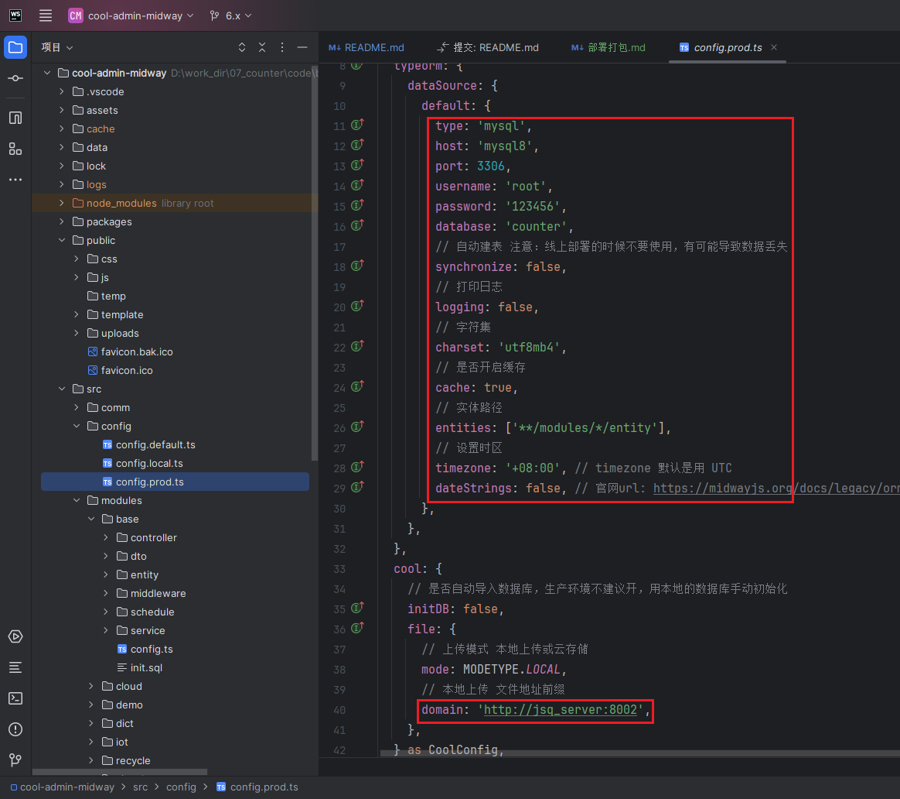
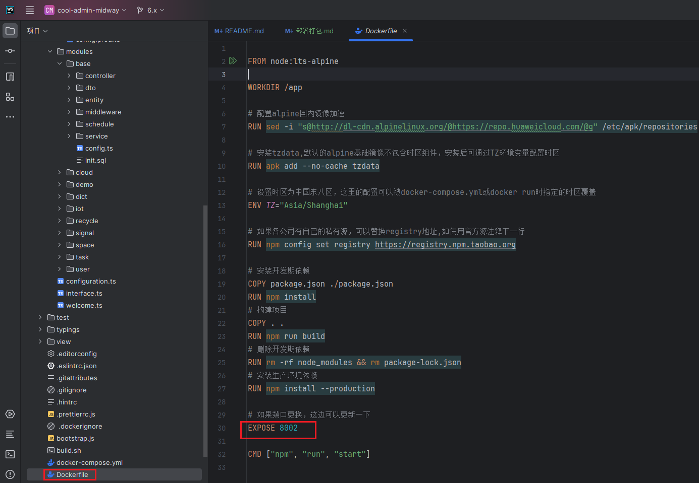
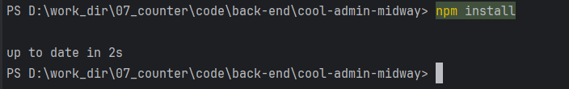
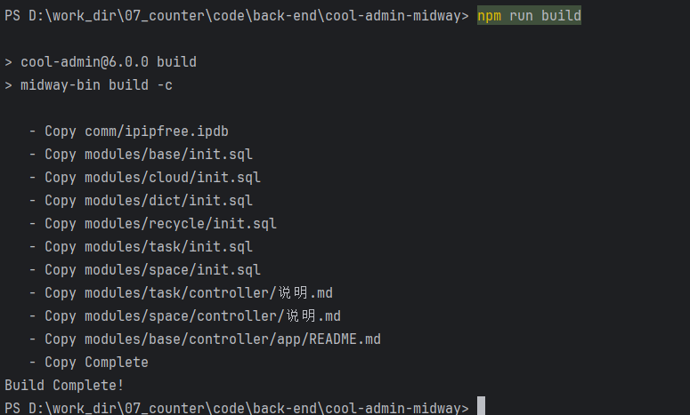
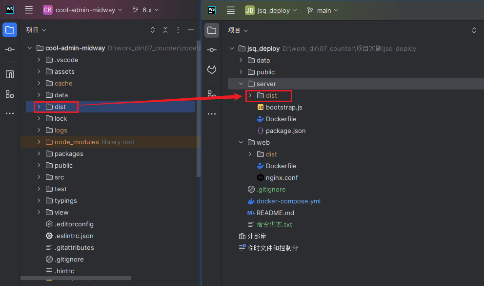

## 如何进行部署打包？


**进入项目后检查`src/config/config.default.ts`该文件中的配置是否正确。**




**检查`src/config/config.prod.ts`文件中的配置是否正确**




**检查`./Dockerfile` 文件中的端口号是否正确，默认`8002`**

> 端口号应当与前端配置保持一致，否则会导致前端无法访问该服务




**执行 `npm install` 命令安装项目依赖**




**执行 `npm run build` 命令编译打包**

```
npm run build
```




**将打包生成的dist文件夹拷贝到 `/jsq_deploy/server/ `目录下**


